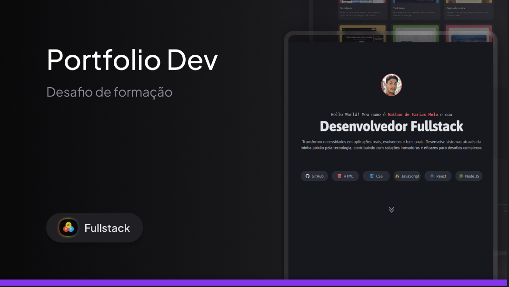

<h1 align="center">Desafio portfólio</h1>

a Challenge by Rocketseat.

 

  

 

## 🚀 Tecnologias

Esse projeto foi desenvolvido com as seguintes tecnologias:

- HTML e CSS

## 💻 Projeto

O objetivo deste projeto é criar uma landing page  elegante para demonstrar meu trabalho. O portfólio inclui seções como:

Projetos: Uma galeria dos meus principais trabalhos, com descrições e links.  
Contato: Uma forma fácil de entrar em contato comigo.

## 💙 Contato 
nathangja09@outlook.com

---
Feito com ♥ by Nathan.
